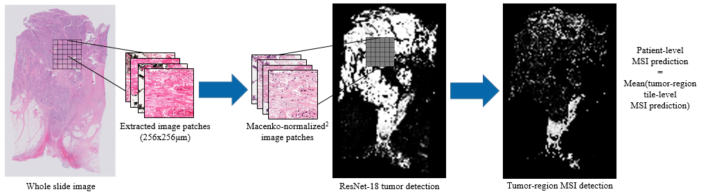

# Deep_learning_WSI_tutorial

This repository is designed to provide an in-depth introduction to deep learning on whole slide images. It assumes the user is familiar with the basics of Python, PyTorch and deep learning. The full walkthrough is provided in [this notebook](Deep_learning_WSI_tutorial.ipynb), and a related slideshow walkthrough is provided in [microsoft powerpoint](Deep_Learning_WSI_Tutorial_Slides.pptx) and [PDF](Deep_Learning_WSI_Tutorial_Slides.pdf) formats.

The notebook walkthrough uses a toy dataset made up of four TCGA WSI files. All TCGA .svs slide files can be downloaded from the TCGA data portal https://portal.gdc.cancer.gov/. The four used for this notebook are:

WSIs/

.../MSI-H/

.../.../[TCGA-5M-AAT6-01Z-00-DX1.8834C952-14E3-4491-8156-52FC917BB014.svs](https://portal.gdc.cancer.gov/files/1203a9f8-caad-4e77-b215-1b49e59e8e1f)

.../.../[TCGA-5M-AATE-01Z-00-DX1.483FFD2F-61A1-477E-8F94-157383803FC7.svs](https://portal.gdc.cancer.gov/files/90448510-59aa-4583-9922-cd70332cbe62)

.../MSS/

.../.../[TCGA-3L-AA1B-01Z-00-DX1.8923A151-A690-40B7-9E5A-FCBEDFC2394F.svs](https://portal.gdc.cancer.gov/files/ff260ac3-4ded-4e17-ba6d-63a025b236b1)

.../.../[TCGA-4N-A93T-01Z-00-DX1.82E240B1-22C3-46E3-891F-0DCE35C43F8B.svs](https://portal.gdc.cancer.gov/files/58415f5d-0768-4431-b363-75a7d47587c3)

